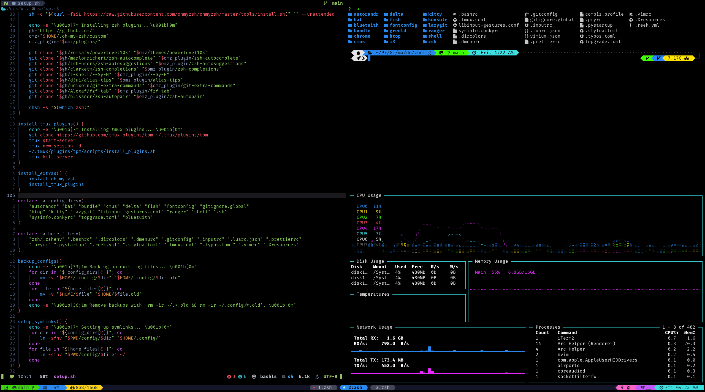

<div align = "center">

<h1><a href="https://2kabhishek.github.io/dots2k">dots2k</a></h1>

<a href="https://github.com/2KAbhishek/dots2k/blob/main/LICENSE">
 </a>

<a href="https://github.com/2KAbhishek/dots2k/graphs/contributors">
 </a>

<a href="https://github.com/2KAbhishek/dots2k/stargazers">
</a>

<a href="https://github.com/2KAbhishek/dots2k/network/members">
 </a>

<a href="https://github.com/2KAbhishek/dots2k/watchers">
 </a>

<a href="https://github.com/2KAbhishek/dots2k/pulse">
 </a>

<h3>Passionately Crafted CLI Setup 🐧❤️</h3>

<figure>
  
  <br/>
  <figcaption>Terminal screenshot</figcaption>
</figure>

</div>

## What's this

My personal configs, carefully and passionately crafted for setting up an optimal CLI dev experience across multiple platforms.

## Inspiration

Hours and nights spent on the terminal, willingness to improve.

## Setup

I made a [recording for setting this up on an Ubuntu system](https://www.youtube.com/watch?v=X8x-gUwucBU&list=PL52YFor3VtLegIRc3uDl9koGP-Fu_YGru)

```bash
git clone https://github.com/2kabhishek/dots2k
cd dots2k

# Menu based interactive setup, recommended for beginners
./setup.sh

# Setup everything unattended
./setup.sh -a
```

> If you plan to use this without using the setup script, make sure to install the recommended packages in the `setup.sh` script.

### Next Steps

#### Git Setup

> [!IMPORTANT]
> Make sure to change the `user.name` and `user.email` in the `~/.gitconfig` file with your own or use `git config --global user.name "Your Name"`
>
> GPG signing is enabled for verifying commits, check [this](https://docs.github.com/en/authentication/managing-commit-signature-verification/adding-a-new-gpg-key-to-your-github-account) for setting up GPG, or you can use `git config --global commit.gpgSign false` to disable it.

#### Fonts

I'll recommend [Nerd Fonts](https://www.nerdfonts.com/).
I'm using [FiraCode 3.11](https://github.com/ryanoasis/nerd-fonts/releases/tag/v3.1.1).

#### Local Configs

Some configs are intentionally not included as they will vary based on every system.
For these, I recommend creating the `~/config/shell/local.sh` file, which you can edit using the `loca` alias.

```bash
#!/bin/sh

export EDITOR=nvim
export CLIPCOPY=wl-copy
export CLIPPASTE=wl-paste
```

You can put all your local aliases, env vars and functions here.

## Included Configs

### Shells

- [bash](./config/.bashrc) - The bash shell.
- [fish](./config/fish/) - The fish shell and related configs.
- [shell](./config/shell) - Shell configuration scripts.
  - [aliases.sh](./config/shell/aliases.sh) - Aliases, shared across shells.
  - [envars.sh](./config/shell/envars.sh) - Environment variables, shared across shells.
  - [functions.sh](./config/shell/functions.sh) - Functions, shared across.
- [zsh](./config/zsh) - The zsh shell and related configs.
  - [.zshrc](./config/zsh/.zshrc) - Main zsh config.
  - [powerlevel2k.zsh](./config/zsh/powerlevel2k.zsh) - Custom Powerlevel2k theme for zsh.

### Development Tools

- [bundle](./config/bundle/config) - A Ruby gem dependency manager.
- [delta](./config/delta/delta.gitconfig) - A syntax-highlighting pager for git and diff output.
- [git](./config/.gitconfig) - Global git configurations.
  - [gitignore.global](./config/gitignore.global) - Global gitignore settings, used in gitconfig.
- [lazygit](./config/lazygit/config.yml) - A simple terminal UI for git commands.
- [luarc](./config/.luarc.json) - Configs for the Lua language.
- [prettier](./config/.prettierrc) - A code formatter.
- [pry](./config/.pryrc) - A Ruby REPL.
- [pystartup](./config/.pystartup) - Python startup configurations.
- [reek](./config/.reek.yml) - A code smell detector for Ruby.
- [stylua](./config/.stylua.toml) - A Lua formatter.
- [tmux](./config/tmux/tmux.conf) - A terminal multiplexer.
- [typos](./config/.typos.toml) - A spell checker for code.
- [vim](./config/.vimrc) - The original text editor.

### System Tools

- [bat](./config/bat/config) - A cat clone with syntax highlighting and Git integration.
- [cmus](./config/cmus/darkwind.theme) - A music player, with a custom theme.
- [bluetuith](./config/bluetuith/bluetuith.conf) - A Bluetooth TUI.
- [dircolors](./config/.dircolors) - Sets up color definitions for GNU ls.
- [htop](./config/htop/htoprc) - An interactive process viewer.
- [inputrc](./config/.inputrc) - Configs for readline, used by bash and other CLI programs.
- [ranger](./config/ranger) - A console file manager.
- [topgrade](./config/topgrade.toml) - Upgrades all packages.

### Terminal Emulators

- [kitty](./config/kitty/kitty.conf) - A GPU-based terminal emulator.
- [konsole](./config/konsole) - The KDE terminal emulator and a nice color scheme.

### Browser

- [vimium](./config/vimium.json) - A browser extension for keyboard navigation.
- [chrome](./config/chrome/userChrome.css) - User styles for Chrome, used with Firefox.

### Window Management

- [autorandr](./config/autorandr) - Manages display configurations on Xorg.
- [compiz](./config/compiz.profile) - A compositing window manager, configs for xfce.
- [conky](./config/sysinfo.conkyrc) - A system widget.
- [dmenu](./config/.dmenurc) - A dynamic menu for X.
- [fontconfig](./config/fontconfig/fonts.conf) - Configures and customizes font access.
- [greetd](./config/greetd/config.toml) - A minimal login manager.
- [i3](./config/i3/config) - A tiling window manager, comes with i3status.
- [libinput-gestures](./config/libinput-gestures.conf) - Binds gestures to commands.
- [Xresources](./config/.Xresources) - Configurations for X applications.

## The dots2k Universe

dots2k serves as a core for some of my other useful dev environments targeted for specific platforms, some tool configs are shared as self contained repos:

### Platform Specific

- [mac2k](https://github.com/2kabhishek/mac2k): Elevate your terminal game on macOS with mac2k!
- [win2k](https://github.com/2kabhishek/win2k): Say goodbye to bland command lines on Windows!
- [termux2k](https://github.com/2kabhishek/termux2k): Supercharge your Android development on the go!

### Development Tools

#### Editor Supreme

- [nvim2k](https://github.com/2kabhishek/nvim2k): Neovim config for ultimate productivity and efficiency.

#### Tmux and Friends

- [tmux2k](https://github.com/2kabhishek/tmux2k): Pretty and functional theme for tmux.
- [tmux-tilit](https://github.com/2kabhishek/tmux-tilit): Add window manager-like capabilities to tmux.
- [tmux-tea](https://github.com/2kabhishek/tmux-tea): Powerful tmux session management.

#### Made for Speed

- [tdo](https://github.com/2kabhishek/tdo): Simple and fast note taking.
- [mkrepo](https://github.com/2kabhishek/mkrepo): Easy and quick GitHub repo setup.
- [ghpm](https://github.com/2kabhishek/ghpm): Easily manage all your GitHub repos.
- [gsync](https://github.com/2kabhishek/gsync): Seamlessly sync your git repos.
- [cmtr](https://github.com/2kabhishek/cmtr): Commit changes quickly.
- [gitrim](https://github.com/2kabhishek/gitrim): Trim accidentally pushed or obsolete files from git history.

### Shell Prompts

- [posh2k](https://github.com/2KAbhishek/posh2k/): Eye candy and power for your oh-my-posh based shells.
- [starship2k](https://github.com/2KAbhishek/starship2k/): Fast and pretty shell with starship.

### Browser

- [qute2k](https://github.com/2kabhishek/qute2k): Keyboard driven browser for vim lovers.
- [nightblue](https://github.com/2kabhishek/nightblue): Theme of choice for Firefox.

### Window Management

- [sway2k](https://github.com/2kabhishek/sway2k): Powerful and flexible window management with sway and Wayland.
- [awesome2k](https://github.com/2kabhishek/awesome2k): Manage your windows with awesome and Xorg.
- [rofi2k](https://github.com/2kabhishek/rofi2k): Streamline your Linux workflow with rofi app launcher.

### Themes

- [BWnB](https://github.com/2KAbhishek/BWnB/): Slightly older theme for KDE and Windows 10.
- [Nightbow](https://github.com/2kabhishek/nightbow): Pitch black theme for VS Code.
- [refind2k](https://github.com/2KAbhishek/refind2k): Pretty boot screen for multi-boot users.

## How it was built

dots2k was built using the internet and sleepless nights.

## Challenges faced

Just getting over the initial learning curve on the command line, failing and trying again :)

## What I learned

While building dots2k I have learned to love the command line, and it's efficiency, have discovered countless tools and techniques, which will serve me for the rest of my days.

## What's next

Planning to add more tools, better management, always updating.

Hit the ⭐ button if you found this useful.

## More Info

Find more cool configs and setups at [GitHub does dotfiles](https://dotfiles.github.io/)

<div align="center">

<a href="https://github.com/2KAbhishek/dots2k">Source</a> |
<a href="https://2kabhishek.github.io/dots2k">Website</a>

</div>
